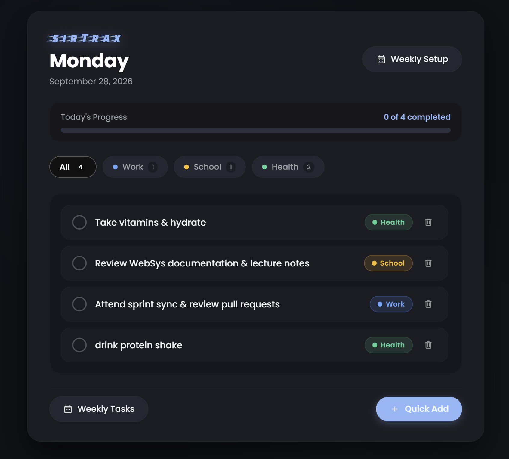
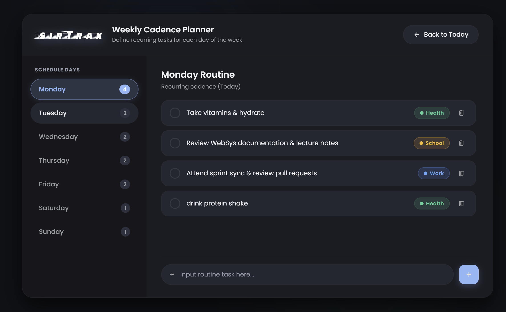
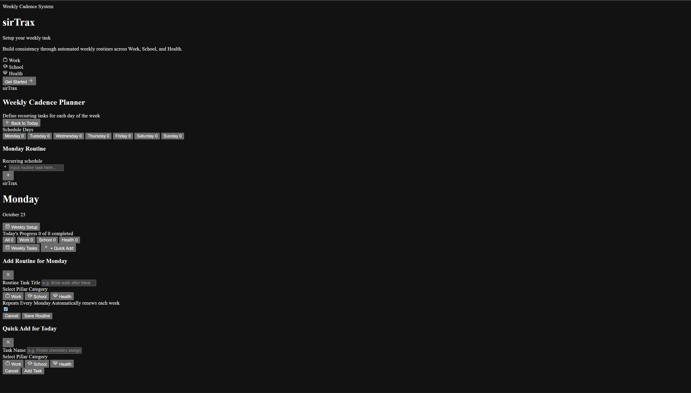

<div align="center">

# ⚡ sirTrax
### Weekly Cadence & Daily Focus Planner

An opinionated, browser-based weekly cadence planner designed to build consistency and eliminate app fatigue through automated recurring routines across **Work**, **School**, and **Health**.

[](#)
[](#)
[](#)

---

### 🎓 Academic Context
**Institution:** Mapúa Malayan Digital College (MMDC)  
**Program:** Bachelor of Science in Information Technology (Major in Software Development)  
**Course / Section:** Web Systems and Technology (MO-IT161) — H3101  
**Deliverable:** Milestone 1: Interactive Frontend Web Application  
**Author:** Marc Denise Cuizon  

---

</div>

## 📸 Interface Previews & Structure Backbone

<div align="center">

### Application Views
*Material You dark interface featuring live execution progress tracking, weekday habit scheduling, and pillar filtering.*

| Daily Execution Dashboard | Weekly Cadence Planner |
| :---: | :---: |
|  |  |

<br>

### HTML Semantic Backbone & View Flow
*Container hierarchy, semantic landmarks, and client-side SPA routing skeleton.*



</div>

---

## 📋 Project Planning & Workflow Worksheet

This application was developed progressively following structured sprint planning and technical constraints. For comprehensive documentation regarding webpage structures, feature priority matrices, interaction mappings, implementation dependencies, and development reflections, please refer to the complete planning worksheet:

📄 <strong><a href="PASTE_YOUR_URL_HERE" target="_blank" rel="noopener noreferrer">View Full Application Development Workflow Worksheet</a></strong>

---

## 📌 1. Project Purpose & Overview

**sirTrax** was born out of a real-world struggle with **app fatigue**—constantly juggling multiple note-taking tools, fragmented reminder systems, and complex project managers just to maintain daily focus. When tools demand too much manual overhead to jot down and categorize items, the friction inevitably leads to procrastination.

**sirTrax** solves this by establishing a structured, automated weekly loop. Rather than treating each morning as an empty, intimidating backlog, routines are defined once per day of the week and automated across three essential life pillars:
* **💼 Work:** Sprint commitments, engineering reviews, pull requests, and retrospectives.
* **🎓 School:** Coursework deliverables, lecture notes review, lab submissions, and study blocks.
* **🏃 Health:** Hydration, daily workouts, outdoor walks, meal prep, and recovery routines.

### Key Architectural Capabilities
* **Zero-Reload SPA Navigation:** Instant client-side view switching between Welcome (`#view-welcome`), Weekly Setup (`#view-setup`), and Daily Dashboard (`#view-dashboard`).
* **Weekly Cadence Looping Engine:** Automatically detects calendar date rollovers via system time, refreshing repeating weekly tasks to uncompleted for the new cycle.
* **Persistent Local Storage:** Client-side CRUD operations and state preservation using `localStorage` without requiring an external backend database.
* **Accessible Material You Aesthetic:** Dark-mode elevation surfaces, pill chips, and custom CSS variables modeled around Android's Material 3 design philosophy.

---

## ✨ 2. Application Features & Interaction Areas

| Component / Interaction Area | Purpose & Functionality | Priority |
| :--- | :--- | :---: |
| **Weekly Cadence Engine** | Maps routines to specific weekdays (Monday–Sunday) and auto-resets completed recurring tasks upon calendar rollover. | **High** |
| **Client-Side SPA Routing** | Class-based view toggling (`.active` / `.hidden`) that switches views smoothly without full browser reloads. | **High** |
| **LocalStorage State Core** | Serializes application state (`state.cadence`) to browser storage, persisting user data across refreshes. | **High** |
| **Pillar Filters ("All", "Work", "School", "Health")** | Real-time memory filtering on the dashboard to view tasks by specific domains with live count badges. | **Medium** |
| **Interactive Progress Bar** | Dynamic circular checkboxes that visually strike through tasks and instantly update completion metrics. | **Medium** |
| **Dual Modal Task Capture** | Dedicated dialog modals for scheduling recurring weekly habits or injecting quick, one-off tasks into today. | **Medium** |
| **Toast Feedback & Security** | Accessible floating toast notifications for user actions and HTML entity sanitization (`escapeHTML`) against XSS. | **Medium** |

---

## 🤖 3. AI Usage & Human Verification Statement

In alignment with MMDC academic integrity guidelines and the course **AI Use Statement (Level 3/4 Output)**, artificial intelligence tools were leveraged as interactive thought partners, prototyping aids, and syntax benchmarks rather than blind code generators[cite: 8].

### AI Tools Utilized
* **Google Stitch:** Rapid prototyping and visual layout translation from Figma sketches[cite: 8].
* **Gemini 3.8 Flash & Gemini 3.1 Pro:** Brainstorming architecture, engineering Stitch prompt descriptions, and organizing workflow documentation[cite: 8].
* **Ollama (Local Models — `qwen3-coder:30b`, `gemma4:e4b`):** Used strictly for comparative analysis to benchmark how the project would look without strict coursework constraints (none of this generated code was incorporated into the final build)[cite: 8].

### Human Oversight, Code Review & Manual Execution
1. **Manual Transcription for Syntax Familiarity:** While AI tools generated alternative code snippets and structural examples, all code was manually typed line-by-line into the code editor[cite: 8]. This intentional practice ensured full comprehension of script execution flow, DOM manipulation, and CSS variable inheritance[cite: 8].
2. **Defensive Audit Against Hallucinations:** AI outputs frequently introduced hallucinated CSS classes, broken element references, and duplicate UI elements (such as pairing SVG icons with redundant literal `+` text symbols). Every component was manually audited and adjusted.
3. **Accessibility (WAI-ARIA) Remediation:** Automated AI suggestions frequently failed accessibility validation. The HTML and JavaScript were audited by hand to implement correct `role="dialog"`, `role="tablist"`, `role="radiogroup"`, `aria-modal="true"`, `aria-checked`, and `aria-live` announcements to ensure full usability compliance[cite: 8].
4. **Scope Control:** Initial ideas for speech-to-text integration (via Web Speech API) and local LLM auto-categorization were deliberately set aside to focus strictly on delivering a clean, maintainable, pure HTML5/CSS3/JavaScript codebase within the milestone timeline[cite: 8].

---

## 🚀 Getting Started

### Local Setup
1. Clone the repository:
   ```bash
   git clone [https://github.com/](https://github.com/)<your-username>/sirTrax.git
